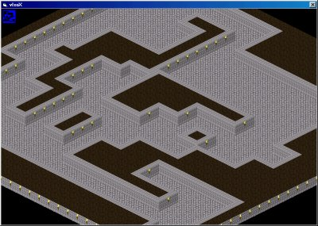



## Isometric Map Example

### Description

Basic Example Of Isometric Map Drawing
 
### More Info
 

             |
---                |---
**Submitted On**   |2001-07-17 15:24:18
**By**             |[Vince Foster](https://github.com/Planet-Source-Code/PSCIndex/blob/master/ByAuthor/vince-foster.md)
**Level**          |Intermediate
**User Rating**    |4.8 (29 globes from 6 users)
**Compatibility**  |VB 6\.0
**Category**       |[Games](https://github.com/Planet-Source-Code/PSCIndex/blob/master/ByCategory/games__1-38.md)
**World**          |[Visual Basic](https://github.com/Planet-Source-Code/PSCIndex/blob/master/ByWorld/visual-basic.md)
**Archive File**   |[Isometric 229317172001\.zip](https://github.com/Planet-Source-Code/vince-foster-isometric-map-example__1-25116/archive/master.zip)

